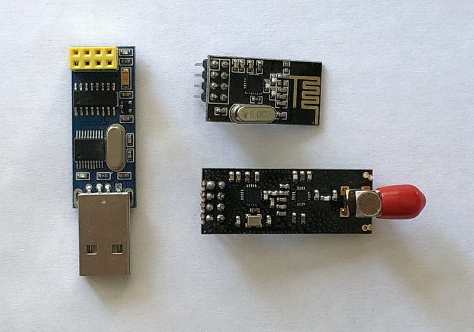
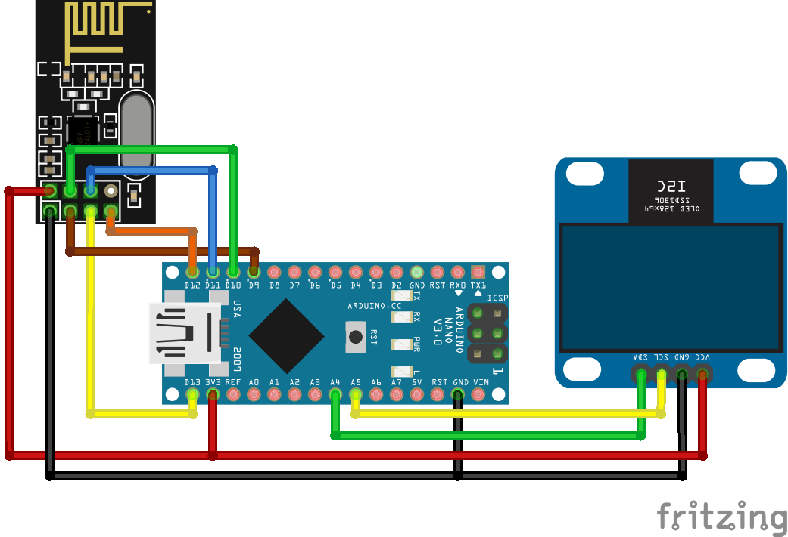
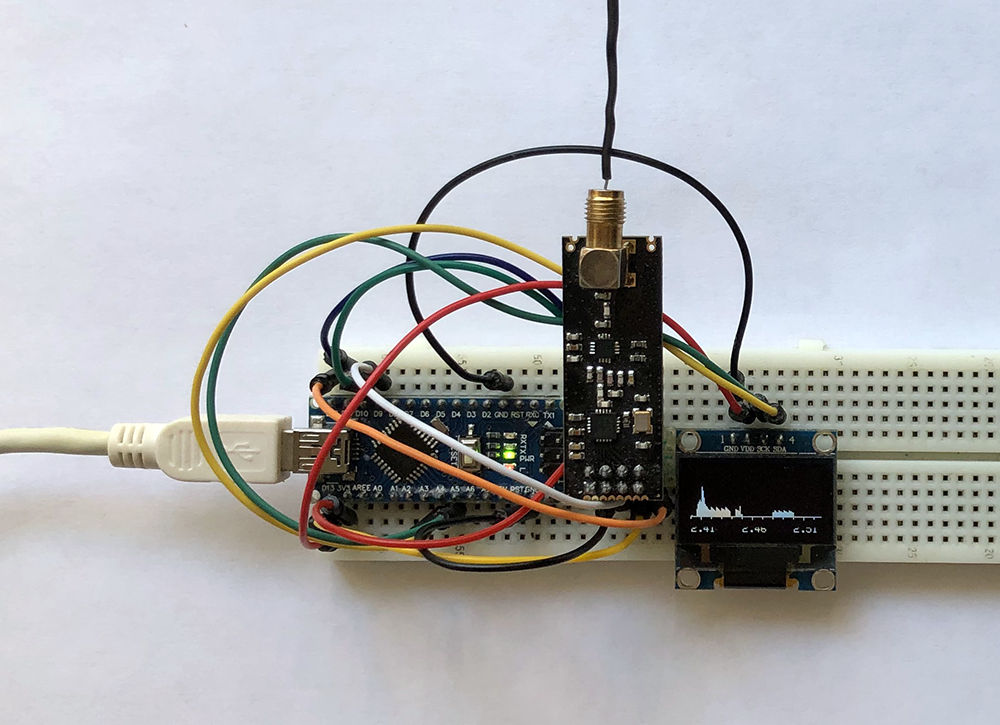

# Arduino_Nano_nRF24L01

Spectrum analyzer on Arduino Nano and Nordic nRF24L01 with I2C OLED's SSD1306. The spectral width is 2400–2527 MHz with spacing in 1 MHz on I2C display. Displays logo on I2C display. This scheme takes less then 50mA (on 5V).

## Equipment

1. Arduino Nano v3.0 or Mini Pro (with 3.3V)
2. Nordic nRF24L01, nRF24L01+, or nRF24L01+PA+LNA module with external antenna
3. OLED 0.96" 128×64 I2C SSD1306 ([fritzing part](../../fritzing-parts/OLED-0.96-128x64-I2C-SSD1306.fzpz))

## Display and nRF24L01 Module

Connect OLED's and nRF24L01 to Arduino Nano as shown on the picture.

## Arduino Nano

The sketch [Very Cheap Arduino-Based 2.4 GHz Band Monitor](https://www.rcgroups.com/forums/showthread.php?2777178-Very-cheap-Arduino-based-2-4-GHz-band-monitor) was developed by Сeptimus.

## Connection Map

| Arduino Nano | nRF24L01      |
| ------------ | ------------- |
| D9           | CE            |
| D10          | CS            |
| D11          | MOSI          |
| D12          | MISO          |
| D13          | SCK           |
| 3V3          | VCC           |
| GND          | GND           |

| Arduino Nano | I2C OLED      |
| ------------ | ------------- |
| A5 (19)      | SCK           |
| A4 (18)      | SDA           |
| 3V3          | VCC           |
| GND          | GND           |

## Problems

Only long-lasting powerful signals are displayed, there is no possibility of quantitative measurement of the signal level.

## Implementation

The prototype is assembled on the breadboard with nRF24L01+PA+LNA module.

