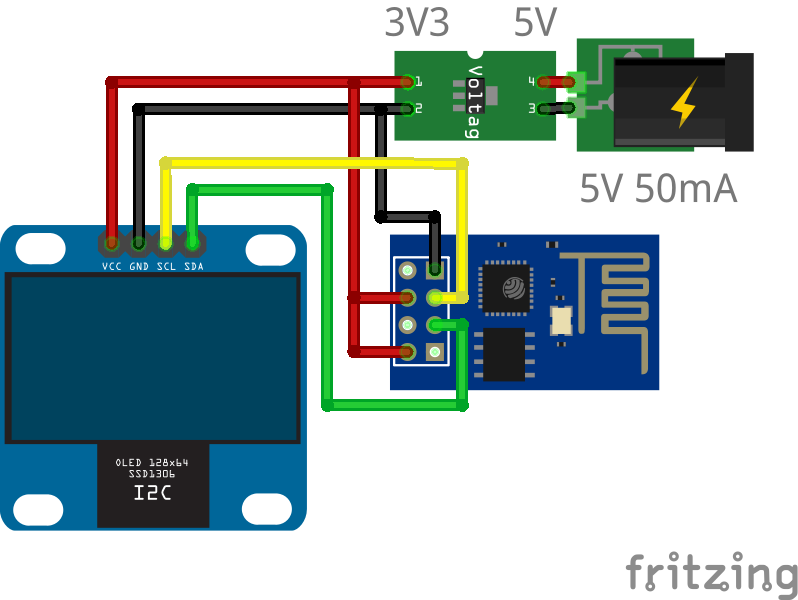
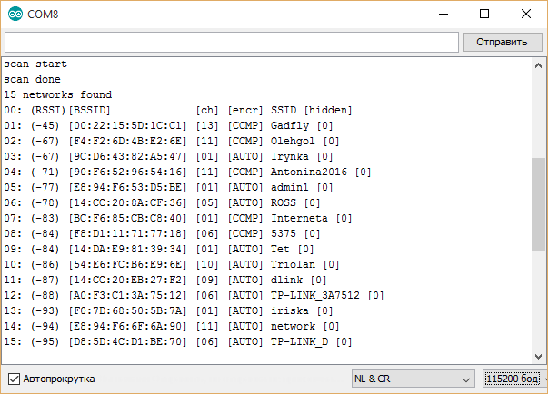
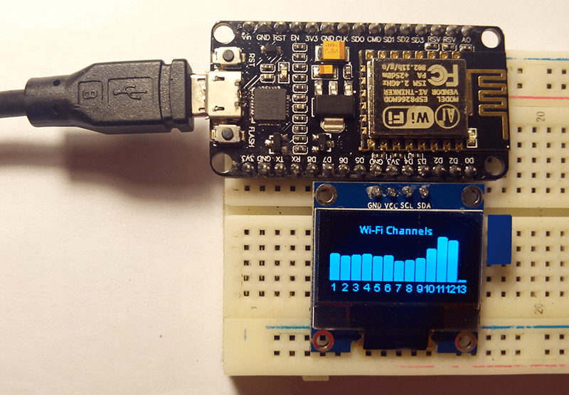

# ESP8266_oled_spectrum_ssd1306

Spectrum analyzer ESP8266 on with I2C OLED's SSD1306. The spectral spectral width is limited to thirteen Wi-Fi channels. Displays data only for channels but not spectrum. This scheme takes less then 50mA (on 5V).

## Equipment

1. ESP8266 ([ESP-01 fritzing part](../../fritzing-parts/ESP8266-1.fzpz))
2. OLED 0.96" 128×64 I2C SSD1306 ([fritzing part](../../fritzing-parts/OLED-0.96-128x64-I2C-SSD1306.fzpz))
3. AMS1117 module (or LM1117)

## Display

Connect OLED to ESP8266 as shown on the picture.

Also you can take a list of AP's via virtual COM-port (when you use a UART-TTL with ESP-01 or NodeMCU).

## ESP8266

Install [ESP8266](http://esp8266.ru/arduino-ide-esp8266/#fast-start) (Russian) libraries in Arduino EDI. This scanner based on standard WiFiScan from SDK and [Driver for the SSD1306 based 128x64 pixel OLED display](https://github.com/squix78/esp8266-oled-ssd1306) written by Daniel Eichhorn.

## Connection Map

| ESP8266-1    | or NodeMCU   | OLED          |
| ------------ | ------------ | ------------- |
| GPIO0        | D3           | SDA           |
| GPIO2        | D4           | SCL           |

| ESP8266-1    | OLED         | AMS1117       |
| ------------ | ------------ | ------------- |
| 3V3, CH_PD   | 3V3          | 3V3           |
| GND          | GND          | GND           |

## Problems

ESP8266 does not have 5V input supply then we have to use an additional voltage converter (AMS1117).

## Implementation

The prototype is made with plug-in modules for debugging convenience. Additionally, you can display the COM-port connectors (Rx, Tx, GND) to read odnovremennoego list of networks.

Or use NodeMCU card.

