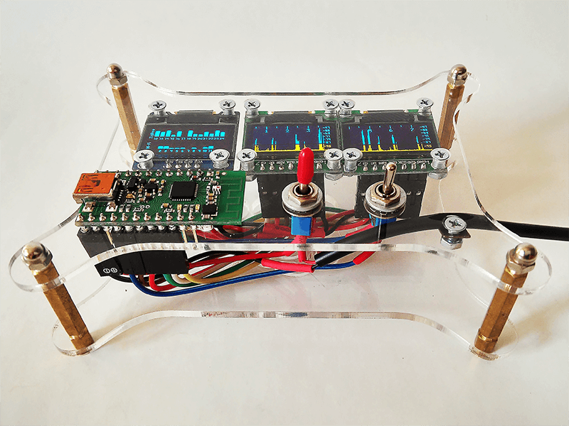
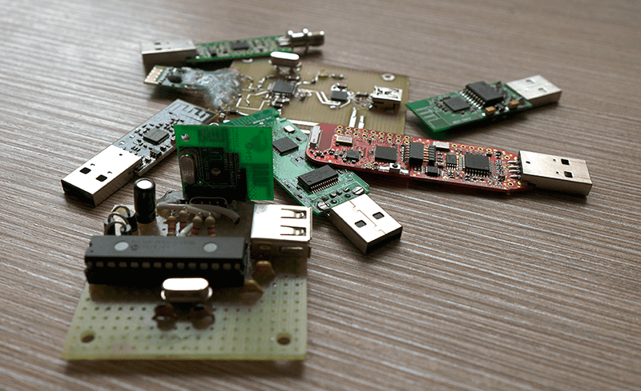

This project created to show ISM 2.4 GHz spectrum on SSD1306 or SSD1331 OLED's on Pololu Wixel, Arduino Nano, ESP8266 or Raspberry Pi.

# Structure

This project helps to biuld spectrum analyzer on different modules. It contains next Pololu Wixel subprojects:

* [_Wixel_ with SPI and/or I2C _OLED's SSD1306_](./Wixel/Wixel_2oleds_ssd1306)
* [_Wixel_ with _ADF4351_ and SPI and/or I2C _OLED's SSD1306_ (noise generator)](./Wixel/Wixel_adf4351)
* [_Wixel_ with two SPI and/or I2C _OLED's SSD1306_](./Wixel/Wixel_3oleds_ssd1306)
* [_Wixel_ with SPI _OLED SSD1331_](./Wixel/Wixel_oled_ssd1331)

And another subprojects:

* [_Raspberry Pi 3_ and _Pololu Wixel_ with SPI and/or I2C _OLED's SSD1306_](./RPi)
* [_Arduino Nano v3_ and _TI CC2500+PA+LNA_ with two SPI and I2C _OLED's SSD1306_](./Arduino_Nano/Arduino_Nano_CC2500)
* [_Arduino Nano v3_ and _nRF24L01_ with I2C _OLED SSD1306_](./Arduino_Nano/Arduino_Nano_nRF24L01)
* [_ESP8266-1_ with I2C _OLED's SSD1306_ Spectrum](./ESP8266/ESP8266_oled_spectrum_ssd1306)
* [_ESP8266-1_ with I2C _OLED's SSD1306_ APs List](./ESP8266/ESP8266_oled_list_ssd1306)

# Projects Comparison Table

| Equipment    | OLED Chip | SPI | I2C | Spectrum | Channels | APs |      |
| ------------ | --------- | ---:| ---:|:--------:|:--------:|:---:| ---- |
| Pololu Wixel | SSD1306   | 128×64 | 128×64 128×32 | ✔ |  |  |  [🔗](./Wixel/Wixel_2oleds_ssd1306) |
| Pololu Wixel | SSD1306   | 128×64 | 128×64 | ✔ |  |  | [🔗](./Wixel/Wixel_ADF4351) |
| Pololu Wixel | SSD1306   | [2×]128×64 | 128×64 | ✔ | ✔ |  | [🔗](./Wixel/Wixel_3oleds_ssd1306) |
| Pololu Wixel | SSD1331   | 96×64 |  | ✔ | ✔ |  |  [🔗](./Wixel/Wixel_oled_ssd1331) |
| Raspberry&nbsp;Pi&nbsp;3, Pololu&nbsp;Wixel | SSD1306   | 128×64 | 128×64 | ✔ |  |  |  [🔗](./RPi) |
| Arduino&nbsp;Nano&nbsp;v3, TI&nbsp;CC2500+PA+LNA | SSD1306   | [2×]128×64 | 128×64 | ✔ |  |  |  [🔗](./Arduino_Nano/Arduino_Nano_CC2500) |
| Arduino&nbsp;Nano&nbsp;v3, nRF24L01 | SSD1306   |  | 128×64 | ✔ |  |  |  [🔗](./Arduino_Nano/Arduino_Nano_nRF24L01) |
| ESP8266-1    | SSD1306   | 128×64 | 128×64 |  | ✔ | ✔ |  [🔗](./ESP8266/ESP8266_oled_spectrum_ssd1306) |
| ESP8266-1    | SSD1306   | 128×64 | 128×64 128×32 |  |  | ✔ | [🔗](./ESP8266/ESP8266_oled_list_ssd1306) |

# Fritzing Parts

Also you can find additional parts for [Fritzing](http://fritzing.org/home/) used in this project schemes:

* [Pololu Wixel](./fritzing-parts/Wixel.fzpz) 
* OLED 0.96" 128×64 [SPI](./fritzing-parts/OLED-0.96-128x64-SPI-SSD1306.fzpz) or [I2C](./fritzing-parts/OLED-0.96-128x64-I2C-SSD1306.fzpz) SSD1306
* [OLED 0.95" 96×64 SPI SSD1331](./fritzing-parts/OLED-0.95-96x64-SPI-SSD1331.fzpz)
* [TI CC2500+PA+LNA](./fritzing-parts/CC2500-PA-LNA.fzpz)
* [Nordic nRF24L01](./fritzing-parts/nRF24L01.fzpz)
* [Espressif ESP8266-1](./fritzing-parts/ESP8266-1.fzpz)

# Task List

* [X] To make a combination device with Arduino and ESP8266.
* [ ] To add in Raspberry Pi project another low-cost ISM spectrum analyzers (Metageek Wi-Spy 2.4i and 2.4x, Ubiquiti AirView2, Wi-detector, and TI eZ430-RF2500) via USB.
* [X] To make a noise generator for 2.4 GHz band.
* [ ] To connect Cypress CYWUSB6935 module to Arduino and STM32 via SPI.
* [X] To connect nRF24L01 module to Arduino via SPI.
* [ ] To connect nRF24L01 module to STM32 via SPI.
* [ ] To connect CC2500 module to STM32 with OLED indication.

# Author

Vladimir Sokolov aka Oestoidea

# Licenses

The source code are licensed under the [GNU GPLv3](https://www.gnu.org/licenses/gpl-3.0.html).
The schematics are licensed under the [CC-BY-SA 3.0](http://creativecommons.org/licenses/by-sa/3.0/).
