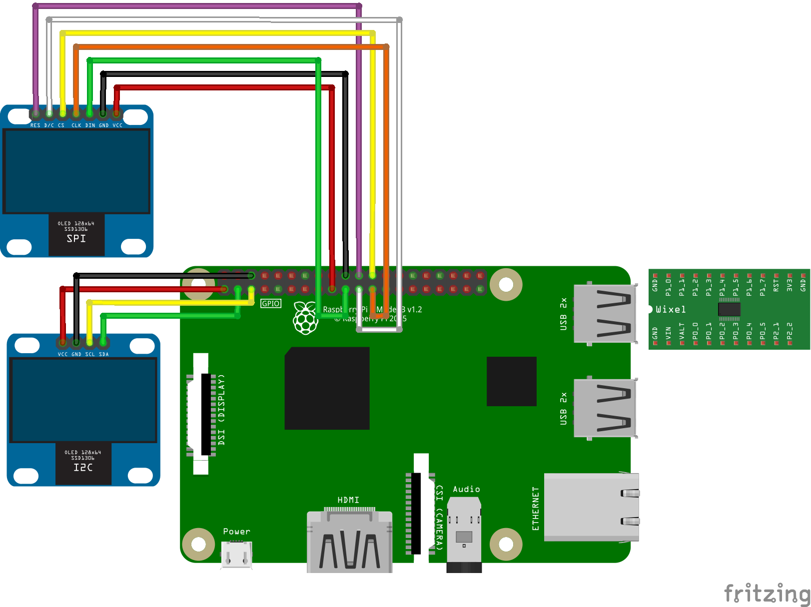

# RPi_2oleds_ssd1306

Spectrum analyzer on Raspberry Pi 3 and Pololu Wixel with SPI and/or I2C OLED's SSD1306.

## Equipment

1. Raspberry Pi 3 (OS Raspbian)
2. Pololu Wixel ([fritzing part](../fritzing-parts/OLED%200.96%20128x64%20I2C%20SSD1306.fzpz))
3. OLED 0.96" 128×64 I2C SSD1306 ([fritzing part](../fritzing-parts/OLED%200.96%20128x64%20I2C%20SSD1306.fzpz))
4. OLED 0.96" 128×64 SPI SSD1306 ([fritzing part](../fritzing-parts/OLED%200.96%20128x64%20SPI%20SSD1306.fzpz))


## Wixel

Download and unzip __wixelcmd__ tool for load the firmware:

```
wget https://www.pololu.com/file/0J872/wixel-arm-linux-gnueabihf-150527.tar.gz
tar -xzvf wixel-arm-linux-gnueabihf-150527.tar.gz
```

Connect the Pololu Wixel to Raspberry Pi by USB and check the connection:

```
sudo ./wixelcmd list
```

Put the firmware on Wixel:

```
sudo ./wixelcmd write RPi_2oleds_ssd1306.wxl -a
```

This scanner based on [Spectrum Analyzer](https://github.com/pololu/wixel-sdk/tree/dev/david/analyzer/apps/spectrum_analyzer) written by David E. Grayson.

## Displays

Connect OLED's to Raspberry Pi as shown on the picture.



## Raspberry Pi 3

For correct operation of the display, set the library [Adafruit](https://github.com/adafruit/Adafruit_Python_SSD1306) on Raspberry Pi and add the Python script [RPi_2oleds.py](./RPi/RPi_2oleds_ssd1306.py).

```
sudo python3 RPi_2oleds_ssd1306.py
```

_If you have only I2C or SPI display just comment lines with missing connection._

## Connection Map

| RPi         | SPI OLED      |
| ----------- | ------------- |
| GPIO25 (22) | RES           |
| GPIO9 (21)  | D/C           |
| GPIO10 (19) | DIN (SDA)     |
| GPIO8 (24)  | CS            |
| GPIO11 (23) | CLK           |
| 3V3 (17)    | VCC           |
| GND (20)    | GND           |

| RPi         | I2C OLED      |
| ----------- | ------------- |
| GPIO3 (5)   | SCK           |
| GPIO2 (3)   | SDA           |
| 3V3 (1)     | VCC           |
| GND (6)     | GND           |

| RPi         | Wixel         |
| ----------- | ------------- |
| USB         | mini USB      |
